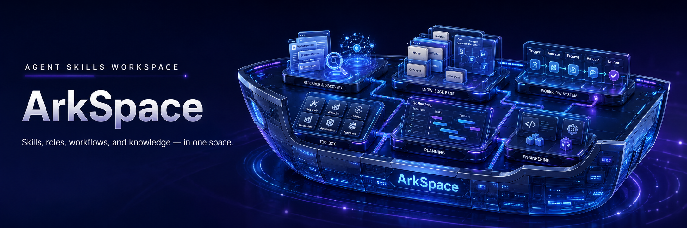

# ArkSpace

<p>
  <a href="README.md">English</a> ·
  <a href="INSTALL.md">安装</a> ·
  <a href="docs/architecture.md">架构</a> ·
  <a href="CONTRIBUTING.md">贡献</a>
</p>



[](https://www.npmjs.com/package/@arkspace/cli)
[](package.json)
[](LICENSE)

**面向 Web 证据、引用研究、浏览器操作与监控的可复用 Agent Skills；只有在需要共享 Provider 执行时，才通过统一且安全的本地边界运行。**

ArkSpace 为 Coding Agent 提供聚焦的操作说明，而不是一个巨型 Prompt。首个版本包含五个 canonical Skills 与 `arks` CLI；CLI 负责协调 Provider 凭证、多 Key 轮询、fallback、远程资源所有权和机器可读结果。

## 两分钟开始使用

### 让 Agent 安装

将下面内容粘贴到 Coding Agent：

```text
请按照仓库 INSTALL.md 的说明，从 https://github.com/arch3rPro/Ark-Space 安装 ArkSpace。修改我的全局 Package、Agent 配置或 MCP 配置前先征得同意。绝对不要要求我在当前对话中粘贴 API Key。需要凭证时，请停下来，让我在可信的本地终端中亲自运行 `arks setup`。只有在我确认完成后才能继续。宣布成功前，请验证 CLI、已安装 Skills 和 Provider readiness。
```

### 或者自行安装

```bash
npm install --global @arkspace/cli@0.1.1
npx skills@latest add arch3rPro/Ark-Space
```

然后亲自在可信的本地终端中运行凭证向导：

```bash
arks setup
arks doctor
arks web search "agent skills"
```

> **不要在 Agent 对话中输入 API Key。** `arks setup` 使用隐藏终端输入，并将本地凭证与配置和状态分开存储。CI 与外部 Secret 管理仍可使用环境变量。

Host 安装、验证、更新、卸载、MCP 和凭证细节见 [INSTALL.md](INSTALL.md)。

## 按目标选择 Skill

| Skill | 用途 |
| --- | --- |
| [`web`](skills/web/SKILL.md) | 查找、读取、发现、抓取或提取公共 Web 与实现证据。 |
| [`research`](skills/research/SKILL.md) | 综合多个公共来源，产出有边界、带引用的报告。 |
| [`browser`](skills/browser/SKILL.md) | 在自有远程浏览器 Session 中读取或改变动态页面状态。 |
| [`monitor`](skills/monitor/SKILL.md) | 管理跨越当前 Session 的周期搜索与站点变化检查。 |
| [`weknora`](skills/weknora/SKILL.md) | 通过 REST API 检索、导入 WeKnora 知识库并基于其文档回答问题。 |

操作标识、Provider 覆盖、Fallback 行为和资源所有权见 [Skill、Capability 与 Provider 参考](docs/capabilities.md)。

## Runtime 提供什么

Skill 可以保持纯指导、自带独立脚本、使用外部应用，或调用 ArkSpace 共享能力。只有最后一种模式要求 `arks`。

```text
Agent Host
  └─ Agent Skill
      ├─ Host 工具 / Skill 自带脚本 / 外部工具
      └─ arks invoke <capability> --input <file>
          ├─ Provider-neutral Capability Handler
          ├─ Exa / Tavily / Firecrawl Adapter
          └─ Credentials、Key Pool、Fallback 与 Owned State
```

共享 Runtime 提供：

- **稳定机器输出：** stdout 只输出一个 Protocol v1 JSON Envelope；诊断进入 stderr。
- **凭证隔离：** Setup 在人类控制的终端完成，Config 与 State 仅保留引用和非敏感元数据。
- **多 Key 管理：** 事务式轮询选择、Cooldown、Disable State 与分类 Fallback。
- **真实的远程生命周期：** Timeout、Cancellation、Acceptance Unknown、Partial Output 与 Cleanup 是不同结果。
- **资源所有权：** Browser Session 与 Monitor 绑定创建它们的凭证，重要副作用需要确认。
- **统一 MCP Adapter：** `arks mcp serve` 暴露同一个 Dispatcher，不复制 Provider 逻辑。

## 人类与机器入口

面向人类的命令注重可发现性：

```bash
arks provider list
arks web fetch "https://example.com/docs"
arks web crawl "https://docs.example.com" --max-pages 20 --max-depth 2
arks code context "current TypeScript SDK usage"
arks research run "compare current agent research APIs" --depth standard
arks browser open "https://example.com"
arks monitor status <monitor-id>
```

Skills 使用稳定的机器边界：

```bash
arks invoke web.search --input search-request.json
arks invoke research.run --input research-request.json
arks invoke browser.open --input browser-open-request.json
arks invoke monitor.create --input monitor-create-request.json
```

Protocol Schema 发布在 [`schemas/protocol/v1/`](schemas/protocol/v1/) 下。

## 安装方式

- **Portable Skills：** 兼容文件系统 Skill 的 Host 可通过 Agent Skills Installer 安装 canonical `skills/` 目录。
- **Claude Code Plugin：** 仓库 Marketplace Manifest 直接引用 canonical Skills。
- **Codex Plugin Metadata：** `.codex-plugin/plugin.json` 指向同一个 canonical 目录。
- **MCP stdio：** Claude Code、Codex 和其他 MCP Host 可在需要工具发现时注册 `arks mcp serve`。

项目不维护生成式 Plugin 镜像。日常 Skill 修改直接更新 canonical source；只有明确发布时才修改 Plugin 版本元数据。

## 安全模型

- 不在 Agent 问答、Chat Message、命令参数、Fixture 或版本控制文件中输入 API Key。
- `arks setup` 将本地 Key 写入用户级 `credentials.json`，并在系统支持时设置限制性权限。
- 显式环境变量覆盖本地存储值。
- `config.json` 保存凭证引用；`state.json` 保存匿名 Key ID 和生命周期元数据。
- Browser 与 Monitor Mutation 需要显式确认；Cleanup 与不确定的远程结果保持可见。

本地 Credential File 包含明文 Secret，并不等同于操作系统 Keychain。为受管环境选择凭证策略前，请阅读 [ADR 0009](docs/adr/accepted/0009-local-credential-setup.md) 与 [Security Policy](SECURITY.md)。

## 版本状态与限制

**0.1.1 是 Preview Update。** 在保留 0.1.0 的 Provider-backed Web、Research、Browser、Monitor 与 MCP 能力基础上，新增由人控制的本地凭证配置、更清晰的 Skill 路由与结果处理、Activation 与 Isolation 验证，以及 Installation-first 文档。

当前限制：

- 要求 Node.js 20 或更高版本，以及具备 Shell、网络和持久用户存储的本地 Host。
- Provider 操作需要对应的 Exa、Tavily 或 Firecrawl 账号，并可能产生 Provider 费用。
- Hosted Cross-platform 与 Credentialed Live-provider Qualification 仍属于[发布后待办](docs/migration.md#post-release-01-qualification-backlog)。
- 本版本不代表现有 ArkSpace 项目已经完成替换切换。

## 项目指南

| 需求 | 阅读 |
| --- | --- |
| 安装、验证、更新或卸载 | [安装说明](INSTALL.md) |
| 理解边界和执行模式 | [架构](docs/architecture.md) |
| 查看迁移和切换门槛 | [迁移计划](docs/migration.md) |
| 查看 0.1 证据与阻塞项 | [0.1 版本证据](docs/migration/v1-evidence.md) |
| 记录实际使用中的阻力与优化证据 | [Field Testing Log](docs/field-testing.md) |
| 新增或设计 Skill | [Adding Skills](docs/adding-skills.md) |
| 配置 MCP stdio | [MCP Transport](docs/mcp.md) |
| 查看目标 Host 与 OS 支持 | [Platform Support](docs/platform-support.md) |
| 理解维护与发布规则 | [Maintenance](docs/maintenance.md) |

## 开发

```bash
git clone https://github.com/arch3rPro/Ark-Space.git
cd Ark-Space
npm install
npm run check
```

修改项目前请阅读 [CONTRIBUTING.md](CONTRIBUTING.md) 与 [AGENTS.md](AGENTS.md)。安全问题按照 [SECURITY.md](SECURITY.md) 报告。

## 许可证

ArkSpace 使用 [MIT License](LICENSE)。外部来源与 Attribution Notice 记录在 [NOTICE.md](NOTICE.md)。
